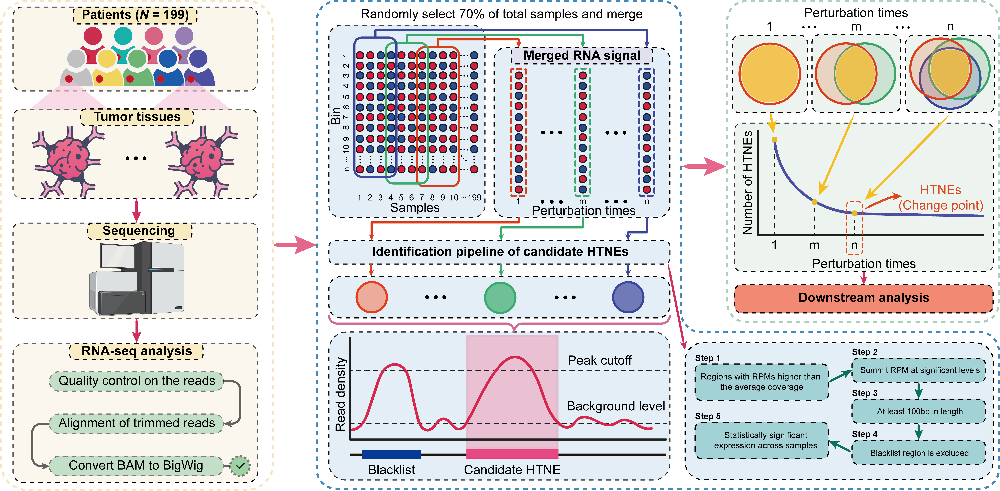

----------
- [HTNEseeker](#htneseeker)
  - [Requirement](#requirement)
  - [Usage](#usage)
  - [License](#license)
----------

# HTNEseeker
 A framework for the identification of highly transcribed noncoding element (HTNE)

## Requirement

*To use the current release*

1. Python 3.7 or later; 
2. R 4.0 or later;
3. The BEDTools suite 2.30.0;
4. Jim Kent's executable programms: http://hgdownload.cse.ucsc.edu/admin/exe/;


## Usage

*Try this program locally*

```shell
$ cd ~
$ git clone https://github.com/weylz/HTNEseeker.git
$ wget http://bioinfo.seu.edu.cn/data/HTNE/test_data.zip # or use test_data folder 

$ cd HTNEseeker
$ mkdir -p ./data/reference && mv ./test_data/blacklist.bed ./data/reference && mv ./test_data/hg19.chrom.sizes ./data/reference
$ mkdir -p ./data/brca && mv ./test_data/$bwfiles ./data/brca
$ mkdir -p ./data/sj/brca && mv ./test_data/$SJfiles ./data/sj/brca

$ chmod 744 ./HTNEseeker.sh
$ chmod 744 ./bin/*

$ ./HTNEseeker.sh $sampleName $sampleNumber $cycleTime
# ./HTNEseeker.sh brca 7 15
```

## License
None

**HTNEseeker © weylz 2022. All rights reserved.**
